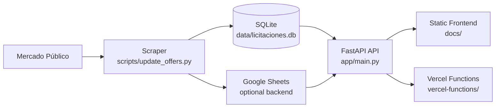

# 📊 ScrapMercadoPublico

A modern Python and FastAPI project for monitoring public procurement opportunities in Chile from Mercado Público. The platform scrapes public tenders, stores them in a local database, exposes a searchable API, and powers a lightweight web experience for browsing and filtering opportunities.

## 🧭 Overview

ScrapMercadoPublico helps users track public tenders and procurement notices in Chile with a simple workflow:

- scrape offers from Mercado Público
- normalize and enrich the data
- store it locally in SQLite
- expose filters and search through a FastAPI API
- browse results through a lightweight frontend

The project is designed to be practical, easy to run locally, and ready for future expansion into subscriptions, email alerts, and richer analytics.

## ✅ Status

- Core scraping and ingestion: working
- API and filtering: working
- Frontend browsing experience: working
- Email alerting and subscriptions: planned

## ✨ Key Features

- Automated offer ingestion from Mercado Público
- Normalized tender data with enriched fields
- Search and filtering by keyword, region, status, organization, amount, and closing date
- Days-to-close calculation and filtering
- Offer name formatting for UTM-based categories
- FastAPI backend with SQLite persistence
- Simple static frontend for browsing offers
- Vercel-compatible serverless API structure

## 🧱 Project Structure

```text
app/                  # FastAPI backend, DB access, query logic
scripts/              # Scraping and integration helpers
docs/                 # Frontend HTML/CSS/JS assets
vercel-functions/     # Vercel serverless API entrypoints
data/                 # SQLite database and runtime logs
tests/                # Automated tests
```

## 🏗️ Architecture at a Glance

The project follows a simple, practical architecture:

- the scraper pulls data from Mercado Público
- the data is normalized and stored in SQLite as the main local source of truth
- the FastAPI backend serves filtered offers through a clean API
- the frontend consumes that API for browsing and search
- Google Sheets can be used as an optional operational layer for shared data workflows and integration scenarios
- Vercel serverless functions provide an additional deployment path for API endpoints



## 🛠️ Tech Stack

- Python 3.9+
- FastAPI
- SQLite
- Uvicorn
- Requests
- pytest
- Vercel serverless functions (optional deployment)

## 🚀 Quick Start

### 1. Clone the repository

```bash
git clone https://github.com/vincentlc/scrapper-mercado-publico-cl.git
cd ScrapMercadoPublico
```

### 2. Create and activate a virtual environment

```bash
python -m venv .venv
source .venv/bin/activate
```

### 3. Install dependencies

```bash
pip install -r requirements.txt
```

### 4. Run the scraper

```bash
python -m scripts.update_offers
```

This will download the latest public tender data, normalize it, and populate the local database.

### 5. Start the API locally

```bash
python -m uvicorn app.main:app --reload --port 8000
```

The API will be available at:

- http://localhost:8000/
- http://localhost:8000/api/offers

### 6. Open the frontend

From the repository root:

```bash
cd docs
python -m http.server 8080
```

Then open http://localhost:8080 in your browser.

## 🔗 API Overview

### Offers endpoint

```http
GET /api/offers
```

Supports filtering by:

- keyword
- tipo_oferta
- estado
- organismo
- region
- comuna
- utm_range
- min_monto
- max_monto
- start_date
- end_date
- start_close_date
- end_close_date
- min_days_to_close
- max_days_to_close
- page
- page_size

Example:

```bash
curl "http://localhost:8000/api/offers?keyword=software&region=Metropolitana&page=1&page_size=20"
```

### Filters options endpoint

```http
GET /api/filters/options
```

Returns available values for common filter fields such as offer type, status, organization, region, and commune.

### Saved filters endpoints

```http
GET /api/saved-filters
POST /api/saved-filters
DELETE /api/saved-filters/{filter_id}
```

These endpoints allow saving reusable query criteria for later use in the frontend.

## 🗂️ Data Model

The main table is `offers`, which stores normalized tender records with fields such as:

- codigo_externo
- nombre
- descripcion
- descripcion_producto
- organismo
- estado
- region
- comuna
- tipo_oferta
- moneda
- monto_estimado
- fecha_publicacion
- fecha_cierre
- dias_que_quedan
- link
- raw_json
- updated_at

The local database is created automatically on startup under `data/licitaciones.db`.

## 🧪 Development Notes

### Running tests

```bash
pytest tests/
```

### Useful scripts

```bash
python -m scripts.update_offers
python -m scripts.init_google_sheets
```

### Logs

The scraper writes execution details to:

```text
data/update_trace.log
```

## 🚢 Deployment

The project includes a Vercel-ready structure under `vercel-functions/` for serverless deployment. Local development is currently centered on the FastAPI app and static frontend, while the Vercel endpoints can be used as an additional deployment target.

## 🛣️ Roadmap

### Near term

- complete and stabilize the alerting workflow
- add email subscriptions and digest delivery
- improve saved-filter management and user experience

### Medium term

- introduce authentication and user accounts
- add dashboards and reporting views
- add export options for filtered results

### Longer term

- broaden integrations with external procurement sources
- enable scheduled background jobs and monitoring
- improve operational reliability and observability

## 📝 Recent Changes

The current codebase includes several relevant improvements:

- richer offer naming with UTM-based formatting
- days-to-close calculation and filtering support
- improved API response fields for frontend rendering
- database migration support for newer filter fields
- updated documentation and project structure
- frontend support for closing-date filters and display formatting

## 🤝 Contributing

Contributions are welcome. If you plan to work on the project, start by running the tests locally and keeping changes focused around the existing architecture.

## 📄 License

This project is provided as-is for educational and practical use. Please review the repository license before production use.
